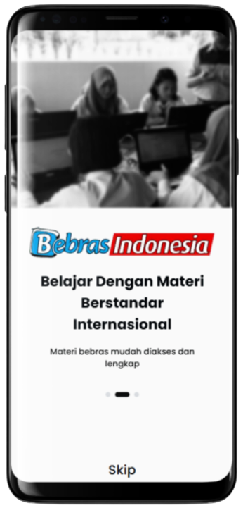

# 🦫 Bebras Pandai

### Repositori ini berisi kumpulan "peralatan" yang digunakan untuk menunjang [Tantangan Bebras Indonesia](#tantangan-bebras-indonesia) & [Gerakan Pandai](#gerakan-pandai)

## Aplikasi
`Bebras Pandai` adalah aplikasi yang dikembangkan oleh [IA-TOKI](https://alumni.toki.id/category/ikatan-alumni/) untuk mendukung pembelajaran *[Computational Thinking](https://www.cs.cmu.edu/~15110-s13/Wing06-ct.pdf)* supaya lebih tersebar luas ke seluruh pelosok Indonesia. 🇮🇩🇮🇩🇮🇩

<a href="https://play.google.com/store/apps/details?id=com.toki.bebras_pandai" style="margin-left:-11px"></a><br />
<!-- <a href=''></a> -->


### Fitur
Ada 2 fitur yang didukung & dikembangkan di aplikasi ini
- `Lihat Materi`         : berisikan segala materi yang bisa Anda pelajari terkait `Tantangan Bebras`
- `Ikuti Latihan Bebras` : mini `Tantangan Bebras` dengan soal (`Bebras Task`) yang selalu diperbarui tiap minggunya 

<a></a>

### Pengembangan Perangkat Lunak

Silahkan menuju [app](app) untuk mengakses direktori utama aplikasi.

#### Struktur Direktori
```
.
├── .github              # github related script
├── app                  # main app directory
├── data                 # data for mockup, schema, etc
|   ├── ..
|   ├── materials        # materials metadata like buku bebras, podcast files, presentations, etc
│   └── question_bank    # example of Bebras Task data
├── docs                 # contains any documentation & its supporting files
|   ├── ..
│   └── assets           # image file et al. used in the documentation
└── utils                # utility tools directory
    ├── ..
    └── scripts          # any script to automate the operational
```
Kita menggunakan arsitektur *monorepo* di repositori ini. Selain `app` sebagai direktori utama, terdapat bagian-bagian lain untuk mempermudah/mengotomatisasi operasional.

#### Kontribusi
Silahkan menuju [CONTRIBUTING.md](docs/CONTRIBUTING.md) mengenai penjelasan cara berkontribusi.

<!--
<a href = "https://github.com/ia-toki/bebras-pandai/graphs/contributors">
    
</a>
-->

<br>

## Glosarium

### Tantangan Bebras Indonesia
tautan: https://bebras.or.id/v3/ \


Tantangan Bebras Indonesia adalah kompetisi yang dilaksanakan secara online dan serentak dengan memberikan soal-soal yang telah dipersiapkan dalam [Workshop Bebras Internasional](https://www.bebras.org/workshops.html), pada <ins>periode bebras week di minggu kedua bulan November</ins>. \
Tantangan Bebras Indonesia dibagi dalam 4 kategori, yaitu:
- `siKecil`, untuk siswa SD dan yang sederajat kelas 3 atau lebih muda
- `Siaga`, untuk siswa SD dan yang sederajat kelas 4-6
- `Penggalang`, untuk siswa SMP dan yang sederajat
- `Penegak`, untuk siswa SMA dan yang sederajat

> [!NOTE]
> ##### Bagaimana cara ikut serta pada Tantangan Bebras?
> Sekolah mendaftarkan siswanya pada Biro bebras yang daftar dan kontaknya dapat diakses di http://bebras.or.id/v3/bebras-biro/

<br>

### Gerakan Pandai
tautan: https://pandai.bebras.or.id/ \


Kegiatan yang dilaksanakan oleh Bebras Indonesia dengan dukungan [google.org](https://www.google.org/) untuk menebarkan dan mengajarkan penguasaan `Computational Thinking` kepada 2 juta siswa, melalui 22.000 guru berbagai mapel di 22 daerah di Indonesia.

<br>

## Lisensi
Karya ini dilisensikan di bawah [Creative Commons Attribution-NonCommercial-ShareAlike 4.0 International (CC BY-NC-SA 4.0)](https://creativecommons.org/licenses/by-nc-sa/4.0/) \
[](https://creativecommons.org/licenses/by-nc-sa/4.0/) \
Hal ini berarti Anda bebas untuk menggunakan dan mendistribusikan karya ini, dengan ketentuan:
- `Attribution`: Apabila Anda menggunakan materi-materi pada karya ini, Anda harus memberikan kredit dengan mencantumkan sumber dari materi yang Anda gunakan.
- `NonCommercial`: Anda tidak boleh menggunakan karya ini untuk keperluan komersial, seperti menjual ulang karya ini.
- `ShareAlike`: Apabila Anda mengubah atau membuat turunan dari materi-materi pada karya ini, Anda harus menyebarluaskan kontribusi Anda di bawah lisensi yang sama dengan karya asli.

<br>

## Didukung Oleh


