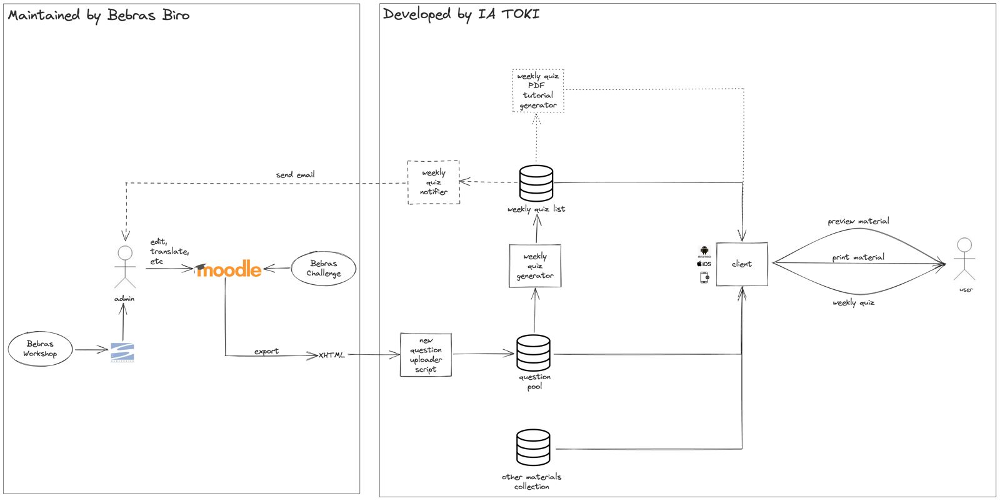

## Development

### Architecture Diagram

The Bebras Challenge will be commissioned by Bebras Biro (admin). IA TOKI is only required in helping to develop a Mobile Application for `Latihan Bebras` (potentially replacing https://latihanbebras.ipb.ac.id).

#### Maintained by Bebras Biro
Here is the usual flow on how to set up the Bebras Challenge:
1. The result from the Bebras Workshop is compiled in SVN central
2. The Bebras Biro (admin) manually picks the question from SVN central and then edits/adjusts to Moodle for the Bebras Challenge
#### Developed by IA TOKI
The purpose of the Application is to make the operation of distributing new tutorials & new Bebras Challenge questions as easy as possible. Hence, several “prioritized” requirements are needed as follows:
- Can be accessed using a mobile device
- Can preview PDF in offline mode
- Can download newly updated resources
- Can try the exercise (`Latihan Bebras`)
- Can automatically generate `Latihan Bebras` weekly
